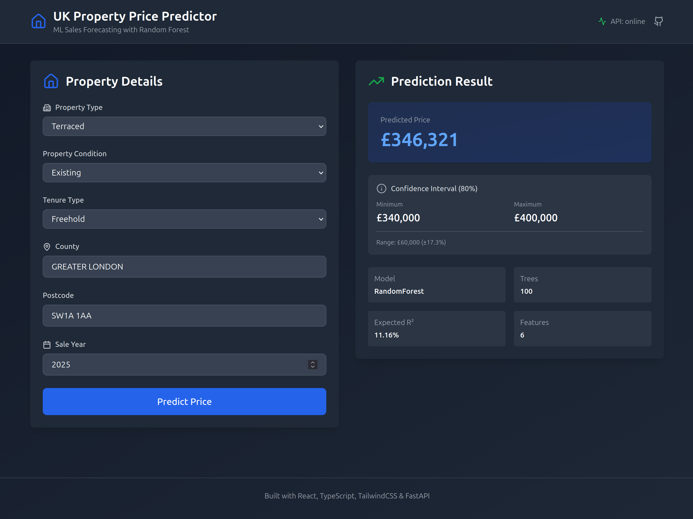
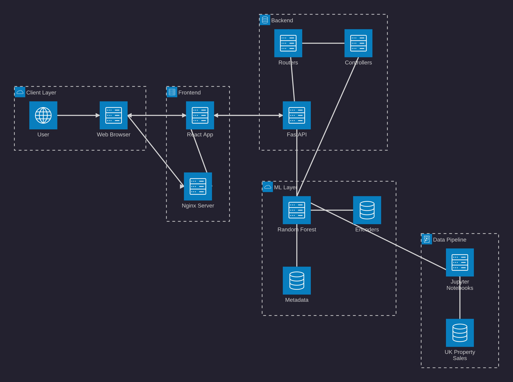

# ML Sales Forecasting - UK Property Price Prediction

[](https://github.com/LucasBiason/ml-sales-forecasting/actions)
[](api-service/htmlcov/index.html)
[](https://www.python.org/downloads/)
[](https://fastapi.tiangolo.com/)
[](https://react.dev/)
[](https://www.docker.com/)

Sistema completo de previsão de preços de imóveis no Reino Unido usando Random Forest, com API FastAPI, frontend React e CI/CD.

## Preview



*Interface completa mostrando formulário de entrada e resultado da predição em tempo real.*

## Arquitetura



*Diagrama simplificado da arquitetura mostrando fluxo entre Client, Frontend, Backend e ML.*

> **Diagrama completo:** [docs/ARCHITECTURE.md](docs/ARCHITECTURE.md) | **Fonte Mermaid:** [docs/diagrams/architecture-beta.mmd](docs/diagrams/architecture-beta.mmd)

### Fluxo de Requisicao

1. **User** preenche formulario no navegador
2. **React** valida e envia POST para `/api/v1/predict`
3. **FastAPI** recebe via Router e delega para Controller
4. **Controller** chama `SalesForecaster.predict()`
5. **Random Forest** usa encoders para processar features
6. **Model** retorna predicao com intervalo de confianca
7. **API** retorna JSON com resultado
8. **React** renderiza resultado na interface

### Request/Response Example

**Frontend → Backend:**
```json
POST /api/v1/predict
Content-Type: application/json

{
  "property_type": "T",
  "county": "GREATER LONDON",
  "postcode": "SW1A 1AA",
  "year": 2024
}
```

**Backend → Frontend:**
```json
{
  "predicted_price": 142301.50,
  "confidence_interval": {"min": 60000, "max": 242300},
  "model_info": {"type": "RandomForest", "n_estimators": 100}
}
```

## Características

- **Machine Learning**: Random Forest com 100% dos dados (99.831 amostras)
- **Frontend React**: Interface moderna com TailwindCSS e TypeScript
- **API REST**: FastAPI com documentação automática (Swagger/ReDoc)
- **Testes**: 75+ testes unitários com 90%+ de cobertura
- **Docker**: Full stack containerizado (API + Frontend)
- **CI/CD**: GitHub Actions com deploy automático
- **Real-time**: Predições instantâneas com intervalo de confiança

## Tecnologias

### Frontend
- React 18 + TypeScript
- Vite (Build tool)
- TailwindCSS (Styling)
- Axios (HTTP client)
- Lucide React (Icons)
- Nginx (Production server)

### Backend
- Python 3.13
- FastAPI (API REST)
- scikit-learn (Random Forest)
- pandas, numpy (Processamento de dados)
- joblib (Serialização de modelos)
- pytest, pytest-cov (Testes e cobertura)

### DevOps
- Docker & Docker Compose (Multi-stage builds)
- GitHub Actions (CI/CD)
- Makefile (Automação)

## Estrutura do Projeto

```
ml-sales-forecasting/
├── notebooks/                    # Jupyter notebooks (venv)
│   ├── 01_exploratory_analysis.ipynb
│   ├── 02_model_selection.ipynb
│   ├── 03_hyperparameter_tuning.ipynb
│   ├── 04_pipeline.ipynb
│   └── models/                   # Modelos treinados
│       ├── final_model.joblib
│       ├── final_label_encoders.joblib
│       ├── final_target_encodings.joblib
│       └── final_metadata.joblib
│
├── api-service/                  # FastAPI (Docker only)
│   ├── app/
│   │   ├── main.py
│   │   ├── models/
│   │   │   └── sales_forecaster.py
│   │   ├── controllers/
│   │   ├── routers/
│   │   ├── schemas/
│   │   └── core/
│   ├── tests/                    # 75+ testes unitários
│   ├── models/                   # Modelos em produção
│   ├── Dockerfile                # Produção (enxuta)
│   ├── Dockerfile.test           # CI/CD (com testes)
│   ├── requirements.txt          # Produção
│   └── requirements-dev.txt      # Dev + testes
│
├── scripts/
│   └── deploy_models.py          # Copia modelos para API
│
├── docs/
│   └── ML_Sales_Forecasting_API.postman_collection.json
│
├── docker-compose.yml            # Produção
├── docker-compose.override.yml   # Dev (hot reload)
├── docker-compose.test.yml       # CI/CD
├── Makefile                      # Comandos simplificados
└── .github/workflows/ci-cd.yml   # GitHub Actions
```

## Quick Start

### 1. Pré-requisitos

- Docker & Docker Compose
- Python 3.13+ (apenas para notebooks)
- Git

### 2. Clone o repositório

```bash
git clone https://github.com/LucasBiason/ml-sales-forecasting.git
cd ml-sales-forecasting
```

### 3. Setup (primeira vez)

```bash
# Copiar modelos treinados para a API
make deploy-models
```

### 4. Rodar aplicação completa (Docker)

```bash
# Full stack (API + Frontend)
make dev-full
```

Acesse:
- **Frontend**: http://localhost:3000
- **API**: http://localhost:8000
- **Docs**: http://localhost:8000/docs

### 5. Rodar testes

```bash
# Testes em Docker (igual ao CI/CD)
make test
```

Relatório de coverage: `api-service/htmlcov/index.html`

## Comandos Disponíveis

### Setup
```bash
make install        # Instalar notebooks (venv)
make deploy-models  # Copiar modelos para API
```

### Development (Docker)
```bash
make dev            # API only (hot reload)
make dev-full       # API + Frontend (full stack)
make test           # Rodar testes
make logs           # Ver logs
make down           # Parar containers
```

### Production (Docker)
```bash
make build          # Build API + Frontend
make up             # Start API only
make up-full        # Start API + Frontend
make down           # Parar tudo
```

### Utilities
```bash
make clean          # Limpar cache
make help           # Ver todos os comandos
```

## Endpoints da API

### Health Check
```bash
GET /
GET /health
```

**Response:**
```json
{
  "status": "healthy",
  "timestamp": "2024-01-15T10:30:00",
  "model_loaded": true,
  "version": "1.0.0"
}
```

### Model Information
```bash
GET /api/v1/model/info
```

**Response:**
```json
{
  "loaded": true,
  "model_type": "RandomForest",
  "n_estimators": 100,
  "features": [...],
  "training_samples": 99831,
  "cv_r2_mean": 0.4390,
  "expected_r2": 0.11
}
```

### Predict Property Price
```bash
POST /api/v1/predict
```

**Request:**
```json
{
  "property_type": "T",
  "old_new": "N",
  "duration": "F",
  "county": "GREATER LONDON",
  "postcode": "SW1A 1AA",
  "year": 2024
}
```

**Response:**
```json
{
  "predicted_price": 425000.50,
  "confidence_interval": {
    "min": 380000.00,
    "max": 470000.00
  },
  "features_used": [...],
  "model_info": {
    "type": "RandomForest",
    "n_estimators": 100,
    "expected_r2": 0.11
  }
}
```

## Frontend React

### Interface

A interface foi desenvolvida com foco em **UX** e **clareza**:

- **Layout responsivo**: Grid adaptável (desktop: 2 colunas, mobile: stack)
- **Dark mode**: Suporte automático
- **Real-time feedback**: Loading states e validação
- **API status**: Indicador online/offline no header
- **Error handling**: Mensagens claras de erro

### Componentes

**ForecastForm** - Formulário de entrada
- 6 campos com validação
- Auto-uppercase para county/postcode
- Ícones intuitivos (Lucide React)
- Loading spinner durante predição

**ForecastResult** - Exibição de resultado
- Preço previsto em destaque
- Intervalo de confiança (80%)
- Informações do modelo
- Formatação em £ (GBP)

### Validação de Entrada

- **property_type**: D (Detached), S (Semi-detached), T (Terraced), F (Flat), O (Other)
- **old_new**: Y (New), N (Existing)
- **duration**: F (Freehold), L (Leasehold), U (Unknown)
- **county**: 2-50 caracteres (auto-uppercase)
- **postcode**: 5-10 caracteres (ex: "SW1A 1AA")
- **year**: 1995-2030

## Testes

Suite completa com 75+ testes unitários:

```bash
# Rodar testes localmente (Docker)
make test

# Ver coverage
open api-service/htmlcov/index.html
```

**Cobertura por módulo:**
- `models/` - 20 testes
- `controllers/` - 6 testes
- `routers/` - 11 testes
- `schemas/` - 28 testes
- `core/` - 4 testes
- `main.py` - 6 testes

## CI/CD

GitHub Actions configurado em `.github/workflows/ci-cd.yml`:

### Pipeline
1. **Test** (sempre)
   - Build container de testes
   - Rodar testes com coverage >= 90%
   - Upload relatório de coverage

2. **Build & Push** (apenas em push para master/develop)
   - Build imagem de produção (enxuta, sem testes)
   - Push para GitHub Container Registry

3. **Deploy** (apenas em master)
   - Deploy automático após build

### Gatilhos
- Push para `master` ou `develop`: Full pipeline
- Pull Request: Apenas testes

## Modelo ML

### Treinamento
- **Dataset**: UK Property Sales (1995-2025)
- **Amostras**: 99.831 transações
- **Modelo**: Random Forest (100 estimators)
- **Features**: 6 (property_type_enc, county_enc, postcode_region_enc, old_new_enc, duration_enc, year)
- **Target**: log(price) - reverte para escala original na predição

### Performance
- **R² geral**: 11.16%
- **R² (imóveis até £1M)**: 27% (98.6% dos casos)
- **MAE**: £86.796
- **Cross-validation R²**: 0.4390 (log scale)

### Encodings
- **Label Encoding**: property_type, old_new, duration
- **Target Encoding**: county (132 categorias), postcode_region (2.253 regiões)

## Desenvolvimento

### Arquitetura Docker-First

**Notebooks**: Rodam em venv local (análise de dados)
```bash
cd notebooks
source venv/bin/activate
jupyter notebook
```

**API**: Roda APENAS em Docker (dev + prod)
```bash
# Development (hot reload)
make dev

# Production
make build
make up
```

### Hot Reload (Development)

O arquivo `docker-compose.override.yml` monta o código fonte como volume:
```yaml
volumes:
  - ./api-service/app:/app/app
```

Mudanças no código recarregam automaticamente.

## Postman Collection

Importar `docs/ML_Sales_Forecasting_API.postman_collection.json`:
- 3 endpoints (Health, Model Info, Predict)
- 10 saved responses (3 sucessos + 7 erros de validação)
- Documentação embutida
- Variável `{{base_url}}`

## Segurança

- **Non-root user**: Container roda como `appuser` (UID 1000)
- **CORS**: Configurado (ajustar origins em produção)
- **Validação**: Pydantic valida todos os inputs
- **Healthcheck**: Monitoramento automático

## Licença

MIT License - veja [LICENSE](LICENSE) para detalhes.

## Autor

**Lucas Biason**
- GitHub: [@LucasBiason](https://github.com/LucasBiason)
- Projeto: [ml-sales-forecasting](https://github.com/LucasBiason/ml-sales-forecasting)

---

**Última atualização**: 29/10/2025
