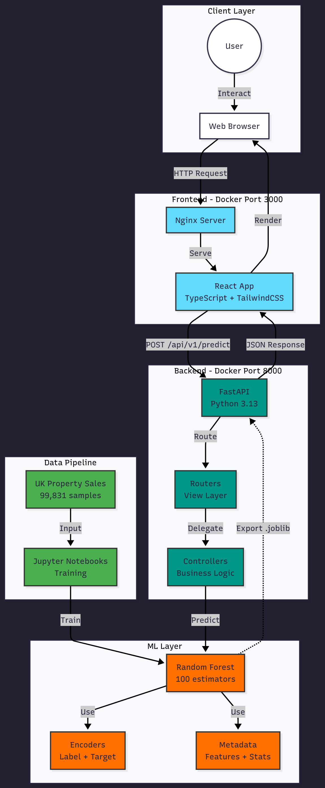

# Arquitetura do Sistema

## Diagrama de Arquitetura



*Diagrama completo mostrando todas as camadas: Client, Frontend, Backend, ML e Data Pipeline.*

> **Fonte Mermaid:** [diagrams/architecture-flow.mmd](diagrams/architecture-flow.mmd)

## Componentes

### 1. Frontend (Port 3000)
- **React 18** com TypeScript
- **TailwindCSS** para styling
- **Axios** para HTTP requests
- **Nginx** para servir produção
- **Hot reload** em desenvolvimento

**Componentes principais:**
- `Header` - Título + API status
- `ForecastForm` - Entrada de dados
- `ForecastResult` - Exibição de resultados
- `InfoCard` - Cards reutilizáveis
- `PriceDisplay` - Formatação £

### 2. Backend (Port 8000)
- **FastAPI** com Pydantic validation
- **MVC Architecture**:
  - `Routers` - Endpoints (view layer)
  - `Controllers` - Business logic
  - `Schemas` - Data validation
- **Multi-worker** em produção (4 workers)
- **Hot reload** em desenvolvimento

### 3. ML Layer
- **Random Forest** (scikit-learn)
- **Label Encoders** - property_type, old_new, duration
- **Target Encoders** - county (132), postcode_region (2,253)
- **Log transformation** no target
- **Confidence interval** (10º-90º percentile)

### 4. Data Pipeline
- **Notebooks Jupyter** para análise
- **Stratified sampling** (100k de 30.5M)
- **Feature engineering** (postcode_region)
- **Cross-validation** (R² = 0.4390)
- **Export .joblib** para API

## Request Flow Detalhado

### 1. User Input
```json
{
  "property_type": "T",
  "county": "GREATER LONDON",
  "postcode": "SW1A 1AA",
  "year": 2024
}
```

### 2. Frontend Validation
- Client-side: Pydantic patterns
- Auto-uppercase: county, postcode
- Range validation: year (1995-2030)

### 3. API Processing
```python
Router → Controller → SalesForecaster.predict()
```

### 4. ML Inference
```python
1. Label encoding (property_type, old_new, duration)
2. Target encoding (county, postcode_region)
3. Create DataFrame [6 features]
4. Random Forest predict (log scale)
5. Revert to original scale (exp)
6. Calculate confidence (tree predictions)
```

### 5. Response
```json
{
  "predicted_price": 142301.50,
  "confidence_interval": {
    "min": 60000.00,
    "max": 242300.00
  },
  "model_info": {
    "type": "RandomForest",
    "n_estimators": 100,
    "expected_r2": 0.11
  }
}
```

## Docker Architecture

### Multi-Stage Builds

**API Dockerfile:**
```
Stage 1 (base):    Install production deps
Stage 2 (test):    Run pytest (coverage >= 90%)
Stage 3 (production): Clean image + entrypoint
```

**Frontend Dockerfile:**
```
Stage 1 (build):   npm ci + npm run build
Stage 2 (production): nginx + static files
```

### Docker Compose Profiles

```yaml
profiles:
  test:     Run tests only
  api:      API only
  frontend: Frontend only
  full:     API + Frontend
```

### Commands

```bash
make dev       # API only (hot reload)
make dev-full  # API + Frontend (hot reload)
make test      # Tests in Docker
make up-full   # Production (API + Frontend)
```

## Security

- **Non-root user** em containers
- **CORS** configurado
- **Input validation** (Pydantic)
- **Security headers** (nginx)
- **Healthchecks** em ambos serviços

## Scalability

- **Horizontal**: Multi-worker FastAPI (4 workers)
- **Vertical**: Random Forest paralelo
- **Cache**: Nginx static assets (1 year)
- **CDN-ready**: Static build otimizado

